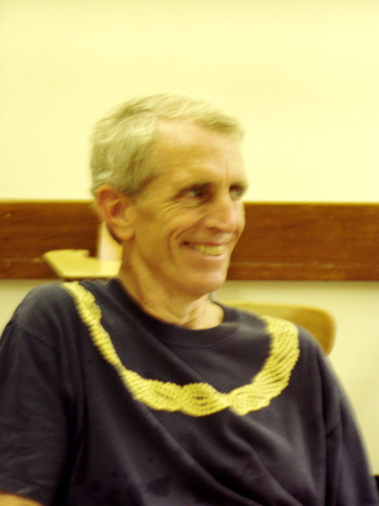
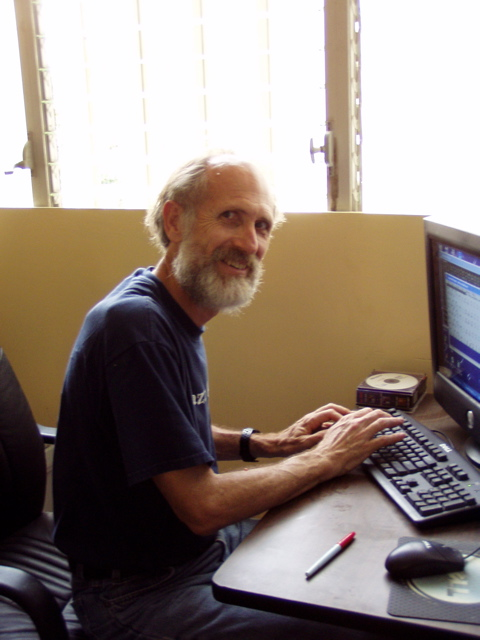
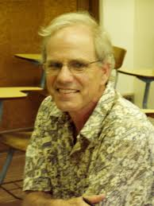
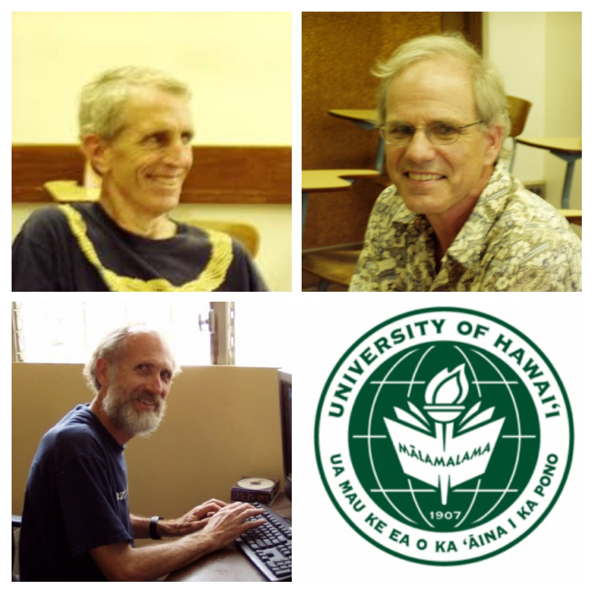

# LatticeTheory.org

<!-- 

 -->

The **Lattice Theory** [github organization](https://help.github.com/articles/about-organizations/) was initially created during the ALH-2018 conference to honor of the long and productive careers of three mathematicians:

+ [Ralph Freese](https://www.math.hawaii.edu/~ralph))

+ [Bill Lampe](https://www.math.hawaii.edu/~bill)  

+ [JB Nation](https://www.math.hawaii.edu/~bill))

<!-- ## Biographies

Both Freese and Nation earned their PhD's under the advisment of [Robert Dilworth](http://www-history.mcs.st-and.ac.uk/Biographies/Dilworth.html) at Caltech, with Ralph graduating in 1972 and JB in ????

Lampe earned his PhD at Penn State under the advisement of Frink and Gratzer. -->

## Related Pages

+ [Freese](assets/Freese/README.md),
  [Lampe](assets/Lampe/README.md), [Nation](assets/Nation/README.md) on latticetheory.org.
+ [The Lattice Theory Homepage](http://math.hawaii.edu/LatThy/)
+ [Universal Algebra Calculator](http://uacalc.org)
+ [Universal Algebra GitHub Organization](https://github.com/universalalgebra)
