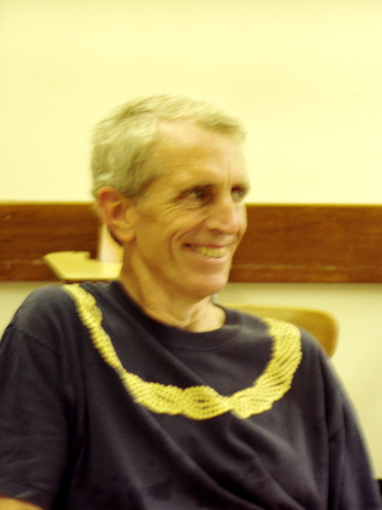

## Bill Lampe

## Bibliographic Data

As of May 2018, 
[MathSciNet](https://mathscinet-ams-org.colorado.idm.oclc.org/mathscinet/search/publications.html?pg1=INDI&s1=194830&sort=Newest&vfpref=html&r=1&extend=1) has reviewed 25 publications by Ralph Freese.  The file [Lampe.bib](Lampe.bib) contains the BibTeX data for all of these works.

**MR Author ID:** 109700  
**Earliest Indexed Publication:** 1967  
**Total Publications:** 25
**Total Related Publications:** 2
**Total Citations:** 106

### Erdos Number

|Coauthor 1  |  Coauthor2 | MathSciNet record number|
| ---        |        --- |--- |
|William A. Lampe | coauthored with Brian A. Davey|	|MR1743633|
|Brian A. Davey	| coauthored with Péter Pál Pálf |MR1290156|
|Péter Pál Pálfy| coauthored with | Paul Erdős1	|MR0954338|

### Coauthors

Brodhead, Katie
Davey, Brian A.
Freese, Ralph S.
Grätzer, George
Idziak, Paweł M.
Khan, Mushfeq
Kjos-Hanssen, Bjørn
McNulty, George F.
Myers, Dale
Nguyen, Paul Kim Long V.
Shore, Richard A.
Sichler, Jiří
Taylor, Walter F.
Trnková, Věra
Šedivá, Věra (2)
Willard, Ross
